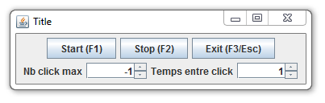

# Clicker (v1.0.0)

Un auto-clicker ultra-basic qui fait le taf'

Une fois lancé, appuyez sur F1 pour le démarrer, F2 pour l'arrêter et ESC pour quitter le programme.
Pas besoin de lui donner le focus, il intercepte toute pressions sur ces touches même quand vous avez une autre fenêtre au premier plan.